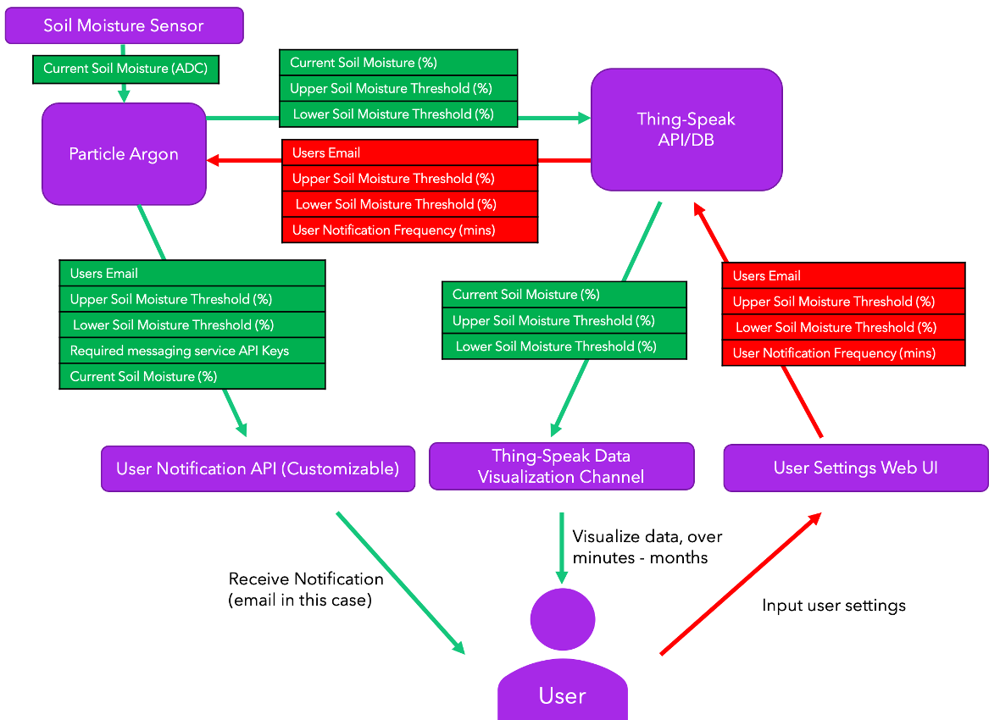

# IrriGator

&nbsp;

## Background

Unpredictable weather conditions and lack of insight into current soil moisture conditions from a home plant owner’s perspective - can lead to water wastage, flora loss, and reduced yield. Soil moisture sensors can be a possible solution to this problem. At present soil moisture monitoring is largely performed manually and requires frequent monitoring/ readings to be taken to gain vital insight into soil conditions for agriculture. Traditional methods of soil moisture monitoring, such as visual inspection or manual measurements, can be time-consuming and labour-intensive. This can limit their usability for recreational plant owners who may not have access to reliable power or internet connectivity. Furthermore – when coupled with a responsive and easy to configure notification system that alerts based on stimulus from a soil moisture sensor system – there is an increased peace of mind and ease of accessibility to everyday users when it comes to maintaining soil conditions, largely managed by an embedded smart soil monitoring system.

&nbsp;

&nbsp;
